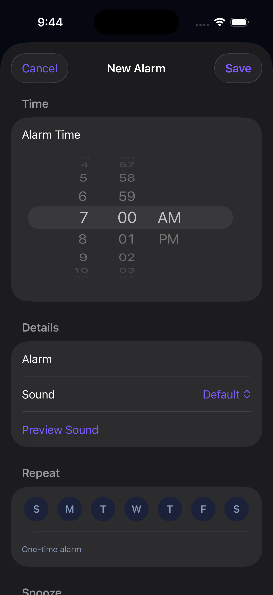
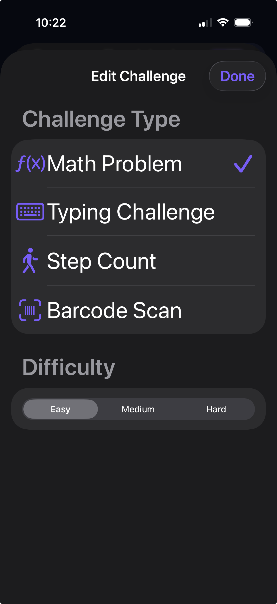
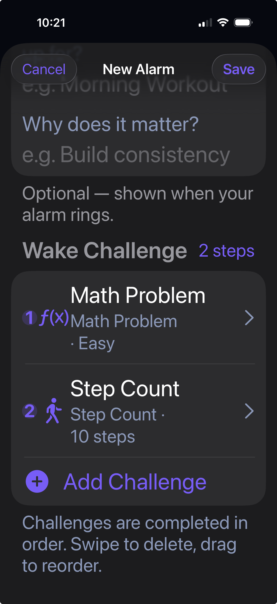

# SnoozeLock — Engineering Case Study

SnoozeLock is a production native iOS alarm application designed to make alarm dismissal more intentional through challenge-based wake workflows.

I designed, built, shipped, and continue to maintain the application using Swift, SwiftUI, AlarmKit, CoreMotion, StoreKit 2, and other Apple frameworks.

**Full portfolio case study:** [SnoozeLock Engineering Case Study](https://gregory-swan-portfolio.netlify.app/project2)

## Engineering Focus

SnoozeLock combines time-sensitive alarm behavior with native device integrations and state-driven user workflows.

Key engineering areas include:

- Alarm scheduling and lifecycle management using AlarmKit
- Challenge-based alarm dismissal workflows
- CoreMotion-based step counting
- Camera-based barcode scanning
- Math and typing challenge validation
- Sequential challenge stacking
- State-driven SwiftUI application architecture
- Free and Pro feature management
- StoreKit 2 purchasing, entitlement handling, and purchase restoration
- Physical-device testing for alarm, camera, motion, and purchase behavior
- App Store deployment and post-release iteration

## Architecture

The application is structured around reusable SwiftUI components, feature-specific services, and shared application state.

Native device functionality is isolated into dedicated services so that alarm behavior, motion tracking, barcode scanning, and premium access can evolve independently without tightly coupling the rest of the application.

A more detailed architecture overview is available in:

[Architecture Overview](Architecture/architecture-overview.md)

## App Screenshots

| Alarm Setup | Challenge Types | Challenge Stacking |
|:---:|:---:|:---:|
|  |  |  |

These screens demonstrate alarm configuration, native-device wake challenges, and sequential challenge workflows.

## Selected Code Samples

This repository intentionally does not contain the complete production source code.

Instead, selected engineering samples will demonstrate:

- AlarmKit scheduling and alarm-state coordination
- CoreMotion-based step-count challenge handling
- Barcode scanning and native device integration

These samples are included to demonstrate engineering decisions and implementation patterns without publishing the complete application.
